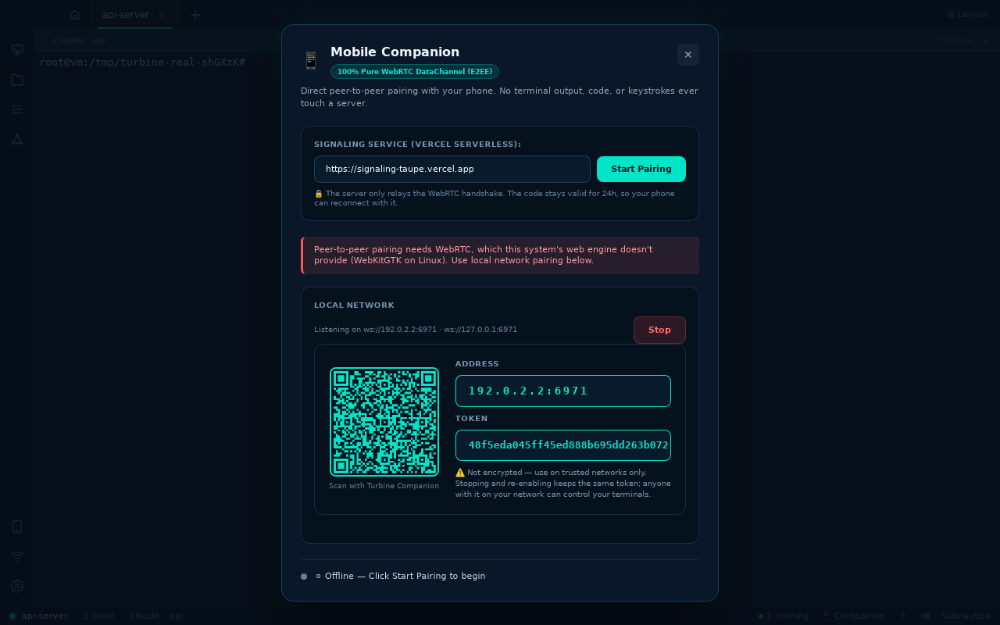
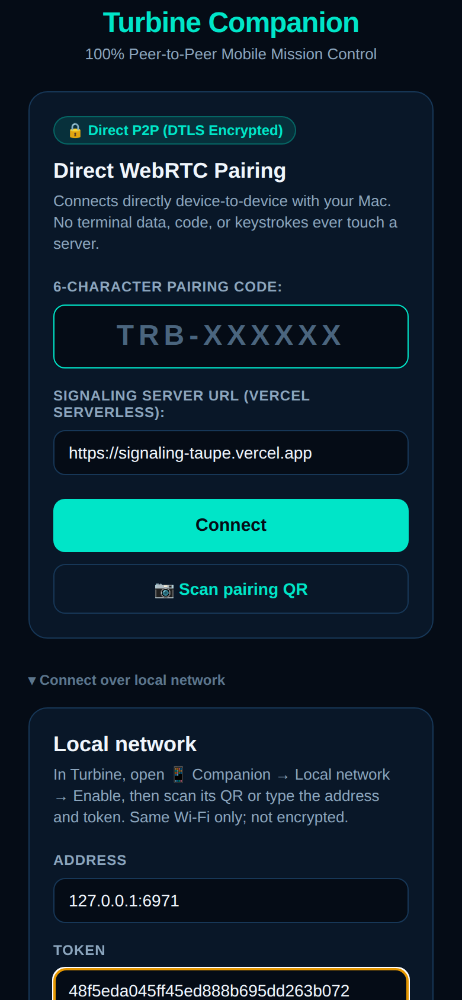
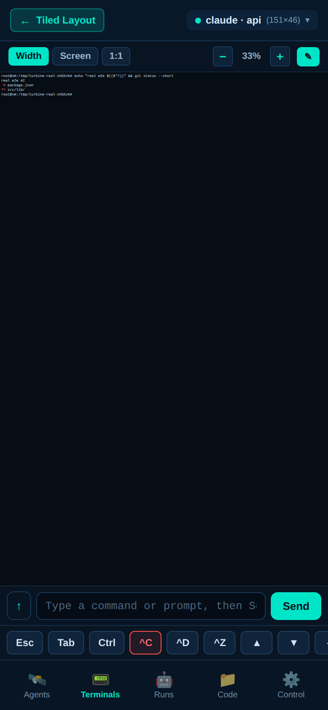
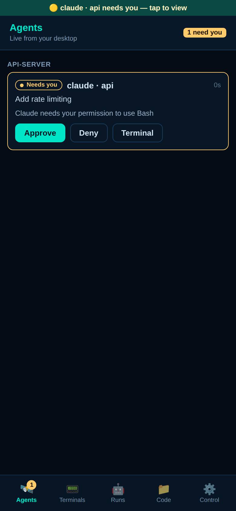
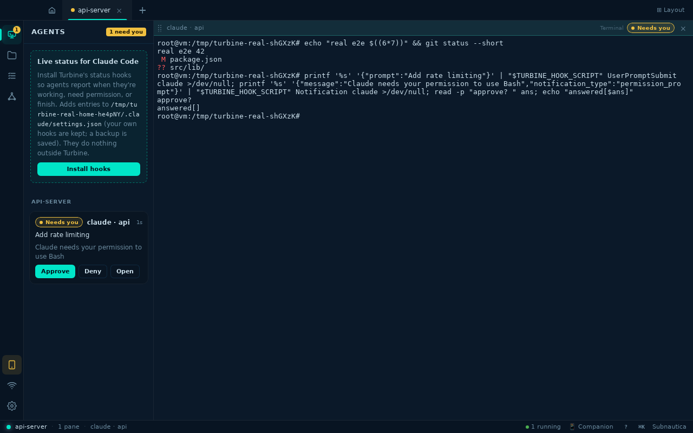
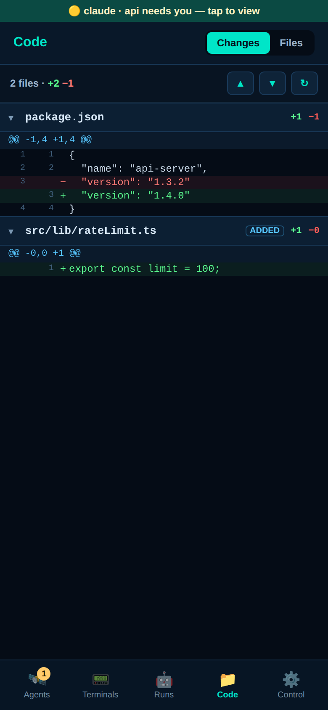
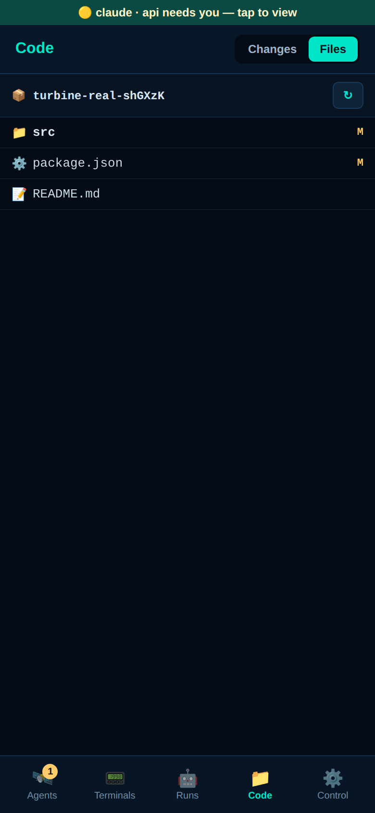

# Real desktop ⇄ real phone (LAN)

Generated by `e2e/real-desktop.mjs`: the actual Turbine debug build (real PTYs, Rust agent hub, LAN server) paired with the actual companion app over the LAN transport.

| Result | Step | Time |
| --- | --- | --- |
| ✅ | Desktop: open the project and enable LAN pairing | 2972ms |
| ✅ | Phone pairs with the real desktop over LAN | 781ms |
| ✅ | Wrong token is rejected by the desktop | 55ms |
| ✅ | Phone types into a real desktop shell | 908ms |
| ✅ | Agent hooks from the real terminal reach the phone; Approve reaches the PTY | 1305ms |
| ✅ | Code tab shows the real git changes, including the new file | 909ms |
| ✅ | No page errors on the phone | 0ms |

### Desktop: Companion → Local network (on Linux WebKitGTK has no WebRTC, so this is the transport)

### Phone: connect over the local network with the address and token from the desktop

### Phone: a real shell on the desktop — the command ran there and streamed back

### Phone: the real agent hook reported “needs you” through the desktop’s status hub

### Desktop: the same agent in the Agents panel (one store, every reader subscribes)

### Phone: real working-tree diff (staged, unstaged and untracked)

### Phone: browsing the real project on disk

